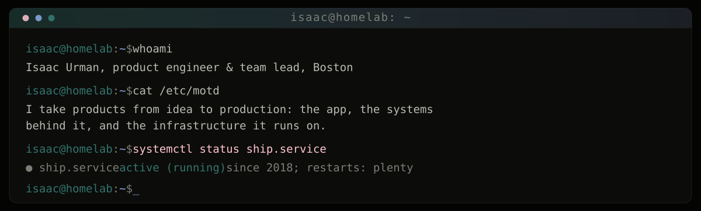

<div align="center">



<p>
  <a href="https://isaacurman.com"><b>Portfolio</b></a>
  &nbsp;·&nbsp;
  <a href="https://isaacurman.com/blog"><b>Blog</b></a>
  &nbsp;·&nbsp;
  <a href="https://www.linkedin.com/in/isaac-urman/"><b>LinkedIn</b></a>
  &nbsp;·&nbsp;
  <a href="mailto:contact@isaacurman.com"><b>Email</b></a>
</p>

</div>

### `$ neofetch`

```
                          isaac@nightsky
       .    *     .       ----------------------------------------------------
  *       .-"""-.         Role ....... Product Engineer & Team Lead
     .   /       \   .    Company .... Tasty LLC - enterprise CRM, 1,000+ users
 .      |    o    |       Team ....... 15+ engineers, one architecture I drew
    *    \       /    .   School ..... B.S. Computer Science, Wentworth Inst. of Tech
      .   `-...-'   *     Location ... Boston, MA (remote)
  .          .            Uptime ..... hosting business, self-run since 2018
      *            .      Kernel ..... Bazzite / Fedora Atomic on a Framework 16
                          Editor ..... Neovim + Claude Code
                          Playing .... ~20 instruments, none of them well
```

### `$ cat ~/README`

I take products from idea to production: the app, the systems behind it, and the infrastructure
it runs on. I like the unglamorous middle of software — data migrations, invoicing edge cases,
deploy pipelines — because that's usually where products live or die.

### `$ ls -la ~/projects`

| mode | Project | What it is | Stack |
| :-- | :-- | :-- | :-- |
| `drwx` | **[resupals](https://resupals.com)** · [code](https://github.com/iurman/resupals) | ATS-optimized resume builder. Runs entirely in-browser: no accounts, no tracking, nothing leaves the tab. | `Next.js` `TypeScript` `TipTap` |
| `drwx` | **[ephemera](https://ephemera.isaacurman.com)** · [code](https://github.com/iurman/ephemera) | Zero-knowledge secret sharing. AES-256-GCM client-side; expires by time or view count, then erased. | `Next.js` `WebCrypto` `tRPC` `Postgres` |
| `drwx` | **[journey](https://github.com/iurman/Senior-Project)** | AI career-planning platform pairing LLM guidance with live job-board data. | `Python` `Django` `LLMs` |
| `drwx` | **[lap-fitness](https://github.com/iurman/lap-fitness)** | Fitness tracker with interactive logging, social features, real-time sync. | `Flutter` `Dart` `Firestore` |
| `drwx` | **[homelab](https://isaacurman.com/projects/homelab-infrastructure)** | Proxmox + TrueNAS + Tailscale, fully monitored. Game hosting business on top since 2018. | `Proxmox` `Grafana` `Linux` |

### `$ tree ~/.stack`

```
~/.stack
├── languages/     typescript  javascript  python  java  sql  bash
├── frontend/      react  next.js  tailwind  flutter  framer-motion
├── backend/       node  trpc  drizzle  postgres  redis  django  fastapi
├── infra/         docker  kubernetes  proxmox  coolify  aws  cloudflare
├── ci/            github-actions  gitlab-ci  ansible
├── observability/ prometheus  grafana  loki
├── ai/            claude-code  codex  mcp  n8n
└── platforms/     salesforce  linear  jira  figma
```

### `$ tail -n 4 ~/blog.log`

```
2026-07-03  Agentic coding in a production monorepo: the harness > the model
2026-07-30  Rebuilding Ephemera as a zero-knowledge secret sharing app
2026-01-29  Deploying Ephemera with Coolify and Traefik
2026-01-20  Building ResuPals: a privacy-first resume builder
```

→ [read them at isaacurman.com/blog](https://isaacurman.com/blog)

### `$ contact --help`

```
usage: contact [OPTIONS]

  --email       contact@isaacurman.com
  --linkedin    /in/isaac-urman
  --web         isaacurman.com
  --hire        currently happy, always curious
```

<div align="center">

<sub><code>isaac@nightsky:~$ exit</code></sub>

<sub><i>Written under a night sky, shipped by morning.</i></sub>

</div>
