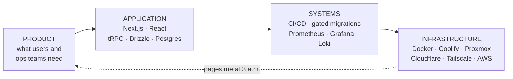

<h1>Isaac Urman</h1>

<h3>Product Engineer &amp; Team Lead</h3>

<i>the app · the systems behind it · the infrastructure it runs on</i>

  <a href="https://isaacurman.com"><b>Portfolio</b></a>
  &nbsp;·&nbsp;
  <a href="https://isaacurman.com/blog"><b>Blog</b></a>
  &nbsp;·&nbsp;
  <a href="https://www.linkedin.com/in/isaac-urman/"><b>LinkedIn</b></a>
  &nbsp;·&nbsp;
  <a href="mailto:contact@isaacurman.com"><b>Email</b></a>

---

Most engineers own one layer. I own the column — and the pager at the bottom of it is what
taught me what to build at the top.

Right now that column is an enterprise CRM used by 1,000+ people, built by a team of 15+ engineers
I lead at Tasty LLC. I designed the architecture, built the finance module end to end, set up the
observability stack, and still write a lot of the code.

## Selected work

| Project | What it is | Stack |
| :-- | :-- | :-- |
| **[ResuPals](https://resupals.com)** · [code](https://github.com/iurman/resupals) | ATS-optimized resume and cover letter builder that runs entirely in the browser. No accounts, no tracking, nothing leaves the tab. | `Next.js` `TypeScript` `Tailwind` `TipTap` |
| **[Ephemera](https://ephemera.isaacurman.com)** · [code](https://github.com/iurman/ephemera) | Zero-knowledge secret sharing. AES-256-GCM in the browser; links expire by time or view count, then the ciphertext is erased. | `Next.js` `WebCrypto` `tRPC` `PostgreSQL` |
| **[Journey](https://github.com/iurman/Senior-Project)** | AI career-planning platform pairing LLM guidance with live job-board data. | `Python` `Django` `LLMs` `Firebase` |
| **[LAP](https://github.com/iurman/lap-fitness)** | Fitness tracker with interactive logging, social features, and real-time sync. | `Flutter` `Dart` `Firestore` |

<b>Where I've done this before</b>

 

| Years | Role | What I owned |
| :-- | :-- | :-- |
| 2025 → | **Senior Software Engineer & Team Lead** · Tasty LLC | Architecture for a TypeScript monorepo, the finance module (payments, invoicing, P&L, 2FA), the observability stack, and CI/CD with senior-gated migrations |
| 2024 → 2025 | **Software Engineer** · Eustace Consulting | Apex, LWC, and Visualforce across 6+ client orgs; large programmatic data migrations; automated billing and invoicing workflows |
| 2024 | **System Administrator Co-op** · MIT Lincoln Laboratory | Containerized a real-time scheduling app, built the GitLab CI/CD pipeline, added MySQL connection pooling, ran the team's Linux servers |
| 2022 → 2024 | **Backend Developer → Assembly Tech III** · SuperLogics | QuickBooks → NetSuite migrations in Python, invoice automation, internal tooling; promoted through three technician levels leading a floor team of 10 |
| 2018 → | **Founder & Systems Operator** · self-run game hosting | Multi-tenant provisioning, tenant isolation, Prometheus/Grafana with Discord alerting, 100+ concurrent players per instance |

**B.S. Computer Science**, minor in Data Science — Wentworth Institute of Technology, Boston

<b>The full stack, honestly labeled</b>

 

| How often | Tools |
| :-- | :-- |
| **Daily** | `TypeScript` `React` `Next.js` `tRPC` `Drizzle` `PostgreSQL` `Docker` `GitHub Actions` `Claude Code` |
| **Regularly** | `Python` `Node.js` `Tailwind` `Prometheus` `Grafana` `Loki` `Coolify` `Cloudflare` `Linux` `Salesforce` |
| **Have shipped with** | `Java` `Flutter` `Dart` `Django` `FastAPI` `Kubernetes` `AWS` `Redis` `MongoDB` `Firebase` `Ansible` `Apex` `LWC` |

<b>What the homelab actually runs</b>

 

Proxmox for virtualization, TrueNAS for storage, Tailscale for access, Unifi for segmentation,
Coolify for deploys, and Prometheus + Grafana watching all of it with alerts landing in Discord.
It hosts my own projects and paying game-server customers, split between home hardware and VPS
providers to balance cost against exposure.

It is the reason I write software the way I do. When you are the one getting paged, you stop
shipping things that page you.

→ [Homelab writeup](https://isaacurman.com/projects/homelab-infrastructure) ·
[Observability with Prometheus and Grafana](https://isaacurman.com/blog/prometheus-grafana-monitoring) ·
[Self-hosting with Coolify and Cloudflare](https://isaacurman.com/blog/self-hosting-coolify-cloudflare)

## Recent writing

- [Agentic Coding in a Production Monorepo: The Harness Matters More Than the Model](https://isaacurman.com/blog/agentic-coding-in-production)
- [Rebuilding Ephemera as a Zero-Knowledge Secret Sharing App](https://isaacurman.com/blog/rebuilding-ephemera-zero-knowledge)
- [Deploying Ephemera with Coolify and Traefik](https://isaacurman.com/blog/deploying-ephemera-coolify-traefik)
- [Building ResuPals — A Privacy-First Resume Builder](https://isaacurman.com/blog/building-resupals-privacy-first-resume-builder)

◇

<b><a href="https://isaacurman.com">isaacurman.com</a></b>

<i>Written under a night sky, shipped by morning.</i>

