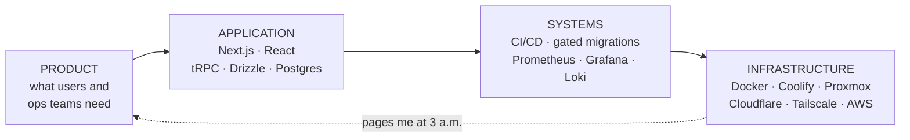

<h1>Isaac Urman</h1>

<h3>Product Engineer &amp; Team Lead</h3>

<i>the app, the systems behind it, and the infrastructure it runs on</i>

  <a href="https://isaacurman.com"><b>Portfolio</b></a>
  &nbsp;&#183;&nbsp;
  <a href="https://isaacurman.com/blog"><b>Blog</b></a>
  &nbsp;&#183;&nbsp;
  <a href="https://www.linkedin.com/in/isaac-urman/"><b>LinkedIn</b></a>
  &nbsp;&#183;&nbsp;
  <a href="mailto:contact@isaacurman.com"><b>Email</b></a>

Most engineers own one layer of this. I own all four, and I'm the one who gets paged when the
bottom one breaks.

Right now that column is an enterprise CRM used by 1,000+ people, built by a team of 15+ engineers
I lead at Tasty LLC. I designed the architecture, built the finance module end to end, set up the
observability stack, and still write a lot of the code.

## Projects

| Project | What it is | Stack |
| :-- | :-- | :-- |
| **[ResuPals](https://resupals.com)** &#183; [code](https://github.com/iurman/resupals) | ATS-optimized resume and cover letter builder. Guest mode keeps everything in your browser with no account and nothing sent to a server. Sign in and documents sync to your own private cloud. | `Next.js` `TypeScript` `Cloudflare Workers` `D1` |
| **[Ephemera](https://ephemera.isaacurman.com)** &#183; [code](https://github.com/iurman/ephemera) | Self-hosted secret sharing. Text, links, and files are encrypted in the browser, expire by time or view count, then get erased from storage. | `Next.js` `WebCrypto` `tRPC` `PostgreSQL` |
| **[Journey](https://github.com/iurman/Senior-Project)** | Career planning platform that pairs LLM guidance with live job board data. | `Python` `Django` `LLMs` `Firebase` |
| **[LAP](https://github.com/iurman/lap-fitness)** | Fitness tracker with interactive logging, social features, and calendar progress views. | `Flutter` `Dart` `Firestore` |

## Stack

  
  
  
  
  
  
  
  
  
  
  
  
  
  
  
  
  
  
  
  
  
  
  

<b>Where I've done this before</b>

 

| Years | Role | What I owned |
| :-- | :-- | :-- |
| 2025 to now | **Senior Software Engineer & Team Lead**, Tasty LLC | Architecture for a TypeScript monorepo, the finance module (payments, invoicing, P&L, 2FA), the observability stack, and CI/CD with senior-gated migrations |
| 2024 to 2025 | **Software Engineer**, Eustace Consulting | Apex, LWC, and Visualforce across 6+ client orgs. Large programmatic data migrations, and automated billing and invoicing workflows |
| 2024 | **System Administrator Co-op**, MIT Lincoln Laboratory | Containerized a real-time scheduling app, built the GitLab CI/CD pipeline, added MySQL connection pooling, ran the team's Linux servers |
| 2022 to 2024 | **Backend Developer, then Assembly Tech III**, SuperLogics | QuickBooks to NetSuite migrations in Python, invoice automation, internal tooling. Promoted through three technician levels leading a floor team of 10 |
| 2018 to now | **Founder & Systems Operator**, self-run game hosting | Multi-tenant provisioning, tenant isolation, Prometheus and Grafana with Discord alerting, 100+ concurrent players per instance |

**B.S. Computer Science**, minor in Data Science, Wentworth Institute of Technology, Boston

<b>What I actually reach for</b>

 

| How often | Tools |
| :-- | :-- |
| **Daily** | `TypeScript` `React` `Next.js` `tRPC` `Drizzle` `PostgreSQL` `Docker` `GitHub Actions` `Claude Code` |
| **Regularly** | `Python` `Node.js` `Tailwind` `Prometheus` `Grafana` `Loki` `Coolify` `Cloudflare` `Linux` `Salesforce` |
| **Have shipped with** | `Java` `Flutter` `Dart` `Django` `FastAPI` `Kubernetes` `AWS` `Redis` `MongoDB` `Firebase` `Ansible` `Apex` `LWC` |

<b>What the homelab actually runs</b>

 

Proxmox for virtualization, TrueNAS for storage, Tailscale for access, Unifi for segmentation,
Coolify for deploys, and Prometheus and Grafana watching all of it with alerts landing in Discord.
It hosts my own projects and paying game server customers, split between home hardware and VPS
providers to balance cost against exposure.

[Homelab writeup](https://isaacurman.com/projects/homelab-infrastructure) &#183;
[Observability with Prometheus and Grafana](https://isaacurman.com/blog/prometheus-grafana-monitoring) &#183;
[Self-hosting with Coolify and Cloudflare](https://isaacurman.com/blog/self-hosting-coolify-cloudflare)

## Writing

<!-- WRITING:START -->

- [Rebuilding Ephemera as a Zero-Knowledge Secret Sharing App](https://isaacurman.com/blog/rebuilding-ephemera-zero-knowledge)
- [Agentic Coding in a Production Monorepo: The Harness Matters More Than the Model](https://isaacurman.com/blog/agentic-coding-in-production)
- [Deploying Ephemera with Coolify and Traefik](https://isaacurman.com/blog/deploying-ephemera-coolify-traefik)
- [Building ResuPals - A Privacy-First Resume Builder](https://isaacurman.com/blog/building-resupals-privacy-first-resume-builder)

<!-- WRITING:END -->

<a href="https://isaacurman.com"><b>isaacurman.com</b></a>

